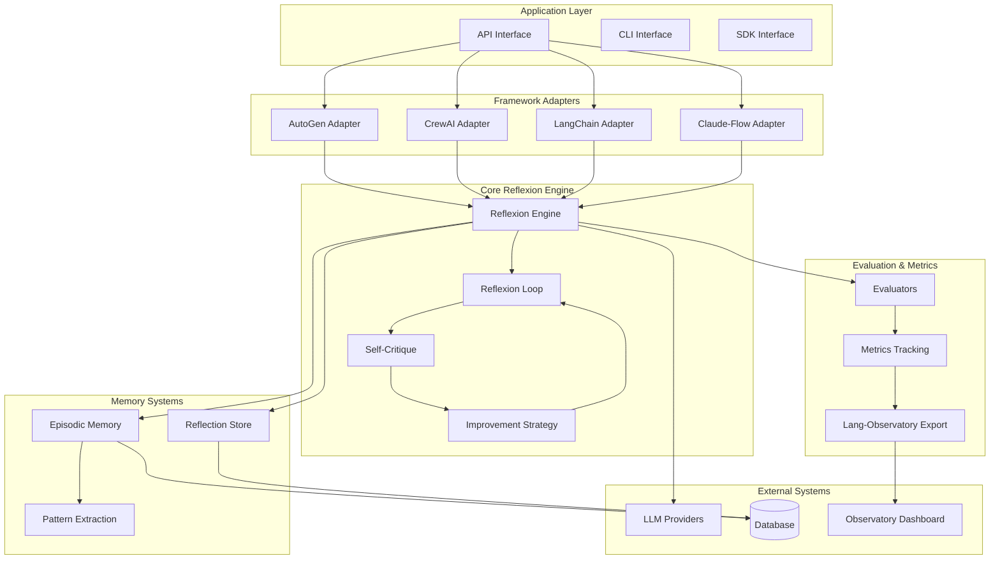
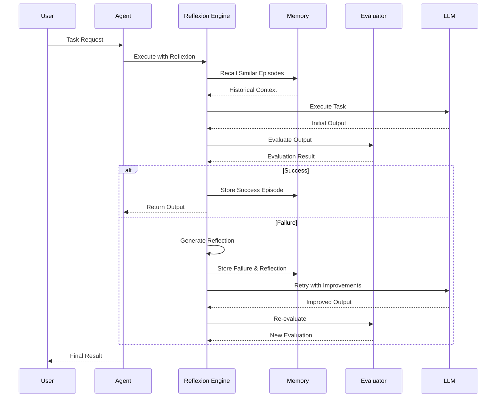

# Architecture Documentation

## System Overview

The Reflexion Agent Boilerplate is a production-ready implementation of the Reflexion methodology for language agents, providing self-reflection and self-improvement capabilities across multiple LLM frameworks.

## Core Architecture

## Component Details

### Reflexion Engine
The core component that orchestrates the reflexion process:
- **Input Processing**: Handles task inputs and context
- **Execution Management**: Coordinates agent execution attempts
- **Reflection Orchestration**: Triggers and manages reflection cycles
- **Improvement Integration**: Applies learned improvements to subsequent attempts

### Framework Adapters
Framework-specific implementations that enable reflexion capabilities:
- **AutoGen Adapter**: Wraps AutoGen agents with reflexion capabilities
- **CrewAI Adapter**: Provides reflexion for CrewAI agents and crews
- **LangChain Adapter**: Integrates with LangChain chains and agents
- **Claude-Flow Adapter**: Enables reflexion in Claude-Flow workflows

### Memory Systems
Persistent storage and retrieval of learning experiences:
- **Episodic Memory**: Stores complete execution episodes with outcomes
- **Reflection Store**: Structured storage of reflections and lessons learned
- **Pattern Extraction**: Identifies recurring patterns in successes and failures

### Evaluation Framework
Metrics and assessment capabilities:
- **Custom Evaluators**: Domain-specific evaluation logic
- **Success Metrics**: Quantitative success measurement
- **Improvement Tracking**: Progress monitoring over time

## Data Flow

## Security Architecture

### Authentication & Authorization
- API key management for LLM providers
- Role-based access control for memory systems
- Secure credential storage and rotation

### Data Protection
- Encryption at rest for memory storage
- Secure transmission of sensitive data
- Privacy-preserving memory retrieval

### Compliance
- GDPR compliance for user data
- SOC 2 compliance for enterprise deployments
- Audit logging for all operations

## Scalability Considerations

### Horizontal Scaling
- Stateless reflexion engine design
- Distributed memory backend support
- Load balancing across multiple instances

### Performance Optimization
- Lazy loading of historical episodes
- Efficient similarity search with embeddings
- Caching of frequent reflections

### Resource Management
- Token usage optimization
- Memory footprint management
- Rate limiting for LLM calls

## Integration Points

### External APIs
- **LLM Providers**: OpenAI, Anthropic, Azure OpenAI
- **Vector Databases**: Pinecone, Weaviate, Chroma
- **Monitoring**: Lang-Observatory, Weights & Biases
- **Storage**: PostgreSQL, MongoDB, Redis

### Framework Compatibility
- **Agent Frameworks**: AutoGen, CrewAI, LangChain
- **Workflow Systems**: Claude-Flow, Temporal
- **ML Platforms**: Hugging Face, LangSmith

## Deployment Architecture

### Development Environment
- Local development with Docker Compose
- Hot reload for rapid iteration
- Integrated testing environment

### Production Environment
- Kubernetes deployment with Helm charts
- Multi-region availability
- Auto-scaling based on load

### Monitoring & Observability
- Structured logging with correlation IDs
- Metrics collection and alerting
- Distributed tracing for complex workflows

## Technology Stack

### Core Technologies
- **Language**: Python 3.9+
- **Async Framework**: AsyncIO
- **Web Framework**: FastAPI
- **Database**: PostgreSQL with async drivers

### Supporting Technologies
- **Vector Search**: Embedding-based similarity search
- **Caching**: Redis for performance optimization
- **Monitoring**: Prometheus + Grafana
- **Deployment**: Docker + Kubernetes

## Future Architecture Considerations

### Planned Enhancements
- Multi-modal reflexion support
- Federated learning across instances
- Real-time collaboration between agents
- Advanced pattern recognition with ML

### Extensibility Points
- Plugin architecture for custom evaluators
- Webhook system for external integrations
- Custom memory backend implementations
- Domain-specific reflection templates

## SDLC Integration

### Development Workflow
- **Continuous Integration**: Automated testing across Python versions
- **Code Quality**: Pre-commit hooks with Black, Flake8, and MyPy
- **Security Scanning**: Automated vulnerability detection with Bandit
- **Documentation**: Auto-generated API docs and architecture diagrams

### Quality Assurance
- **Test Coverage**: Minimum 90% code coverage requirement
- **Performance Testing**: Benchmark reflexion loop performance
- **Security Audits**: Regular dependency and code security scans
- **Compliance Checks**: GDPR and SOC 2 compliance validation