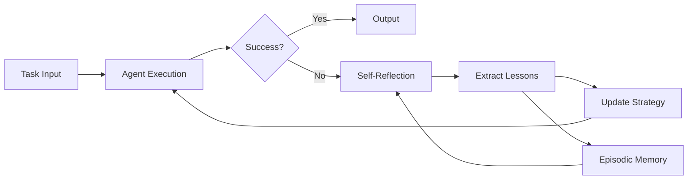

# reflexion-agent-boilerplate

[](https://github.com/your-org/reflexion-agent-boilerplate/actions)
[](LICENSE)
[](https://www.python.org/downloads/)
[](https://github.com/your-org/reflexion-agent-boilerplate)

Production-ready implementation of Reflexion (self-reflection + self-improvement) for language agents. Bolt self-evaluation and iterative refinement onto any LLM framework with minimal code changes.

## 🎯 Key Features

- **Framework Agnostic**: Works with AutoGen, CrewAI, Claude-Flow, LangChain, or raw APIs
- **Episodic Memory**: Structured storage of successes, failures, and learnings
- **Self-Critique Templates**: Pre-tuned prompts for various domains (coding, analysis, creative)
- **Metrics Export**: Reflexion scores → Lang-Observatory dashboards
- **Failure Recovery**: Learn from errors and automatically retry with improvements
- **Human-in-the-Loop**: Optional human feedback integration

## 📋 Table of Contents

- [Installation](#installation)
- [Quick Start](#quick-start)
- [Core Concepts](#core-concepts)
- [Framework Integration](#framework-integration)
- [Memory Systems](#memory-systems)
- [Evaluation & Metrics](#evaluation--metrics)
- [Advanced Usage](#advanced-usage)
- [Examples](#examples)
- [API Reference](#api-reference)
- [Contributing](#contributing)

## 🚀 Installation

### From PyPI

```bash
pip install reflexion-agent-boilerplate
```

### From Source

```bash
git clone https://github.com/your-org/reflexion-agent-boilerplate
cd reflexion-agent-boilerplate
pip install -e ".[all]"  # Install all framework adapters
```

### Framework-Specific Installation

```bash
# Just AutoGen adapter
pip install reflexion-agent-boilerplate[autogen]

# Just CrewAI adapter  
pip install reflexion-agent-boilerplate[crewai]

# Just LangChain adapter
pip install reflexion-agent-boilerplate[langchain]
```

## ⚡ Quick Start

### Basic Usage

```python
from reflexion import ReflexionAgent

# Wrap any LLM call with reflexion
agent = ReflexionAgent(
    llm="gpt-4",
    max_iterations=3,
    reflect_on_failure=True
)

# Execute task with automatic self-improvement
result = agent.run(
    task="Write a Python function to find the longest palindromic substring",
    success_criteria="passes all test cases"
)

print(f"Final solution: {result.output}")
print(f"Iterations: {result.iterations}")
print(f"Self-reflections: {result.reflections}")
```

### With AutoGen

```python
from autogen import AssistantAgent
from reflexion.adapters import AutoGenReflexion

# Enhance existing AutoGen agent
base_agent = AssistantAgent(
    name="coder",
    llm_config={"model": "gpt-4"}
)

# Add reflexion capabilities
reflexive_coder = AutoGenReflexion(
    base_agent=base_agent,
    memory_type="episodic",
    reflection_prompt="coding_reflection_v2"
)

# Use normally - reflexion happens automatically
reflexive_coder.initiate_chat(
    message="Implement binary search with bug fixes"
)
```

### With CrewAI

```python
from crewai import Agent, Task
from reflexion.adapters import CrewAIReflexion

# Create reflexive agent
agent = Agent(
    role="Senior Developer",
    goal="Write bug-free code",
    tools=[...],
    llm="gpt-4"
)

reflexive_agent = CrewAIReflexion(
    agent=agent,
    reflection_strategy="after_each_task"
)

# Reflexion triggers automatically on task execution
task = Task(
    description="Implement a thread-safe cache",
    agent=reflexive_agent
)
```

## 🧠 Core Concepts

### The Reflexion Loop



### Reflection Types

```python
from reflexion import ReflectionType

# Binary reflection (success/failure)
agent = ReflexionAgent(
    reflection_type=ReflectionType.BINARY,
    success_threshold=0.8
)

# Scalar reflection (continuous score)
agent = ReflexionAgent(
    reflection_type=ReflectionType.SCALAR,
    reflection_metric="code_quality"
)

# Structured reflection (multi-dimensional)
agent = ReflexionAgent(
    reflection_type=ReflectionType.STRUCTURED,
    dimensions=["correctness", "efficiency", "readability"]
)
```

### Self-Critique Prompts

```python
from reflexion.prompts import ReflectionPrompts

# Use pre-built domain-specific prompts
prompts = ReflectionPrompts.for_domain("software_engineering")

# Or create custom prompts
custom_prompts = ReflectionPrompts(
    initial_reflection="""
    Analyze your solution for:
    1. Correctness: Does it solve the problem?
    2. Edge cases: What inputs might break it?
    3. Performance: Can it be optimized?
    """,
    
    improvement_strategy="""
    Based on the issues identified:
    - Fix critical bugs first
    - Add input validation
    - Optimize bottlenecks
    """
)

agent = ReflexionAgent(reflection_prompts=custom_prompts)
```

## 🔧 Framework Integration

### AutoGen Integration

```python
from reflexion.adapters.autogen import AutoGenReflexion
from autogen import AssistantAgent, UserProxyAgent

# Create reflexive assistant
assistant = AutoGenReflexion(
    name="reflexive_assistant",
    system_message="You are a helpful AI that learns from mistakes",
    llm_config={"model": "gpt-4"},
    
    # Reflexion config
    max_self_iterations=3,
    reflection_triggers=["task_failure", "user_feedback_negative"],
    memory_window=10  # Remember last 10 interactions
)

# Create user proxy with feedback
user = UserProxyAgent(
    name="user",
    human_input_mode="ALWAYS",
    code_execution_config={"use_docker": True}
)

# Reflection happens automatically during chat
user.initiate_chat(
    assistant,
    message="Help me debug this Python code..."
)
```

### CrewAI Integration

```python
from reflexion.adapters.crewai import ReflexiveCrewMember
from crewai import Crew, Task

# Create reflexive agents
researcher = ReflexiveCrewMember(
    role="Research Analyst",
    goal="Find accurate information",
    backstory="Expert at verifying sources",
    
    # Reflexion settings
    reflection_after_tools=True,
    learn_from_crew_feedback=True
)

writer = ReflexiveCrewMember(
    role="Content Writer",
    goal="Create engaging content",
    
    reflection_strategy="progressive",  # Reflect more on repeated failures
    share_learnings=True  # Share insights with crew
)

# Form crew with collective learning
crew = Crew(
    agents=[researcher, writer],
    tasks=[...],
    verbose=True
)

# Agents will self-reflect and share learnings
result = crew.kickoff()
```

### LangChain Integration

```python
from langchain.agents import AgentExecutor
from reflexion.adapters.langchain import ReflexionChain

# Wrap any LangChain agent
base_chain = AgentExecutor.from_agent_and_tools(
    agent=agent,
    tools=tools
)

reflexive_chain = ReflexionChain(
    chain=base_chain,
    reflection_parser=lambda x: {"score": 0.7, "issues": ["too verbose"]},
    improvement_prompt=PromptTemplate(...)
)

# Run with automatic reflection
result = reflexive_chain.run("Analyze this dataset...")
```

### Claude-Flow Integration

```python
from claude_flow import Flow, Task
from reflexion.adapters import ClaudeFlowReflexion

# Add reflexion to flows
flow = Flow(
    tasks=[
        Task("research", reflexion=True),
        Task("analyze", reflexion=True),
        Task("report", reflexion=True)
    ]
)

# Configure per-task reflection
ClaudeFlowReflexion.configure(
    flow,
    reflection_depth=2,
    cross_task_learning=True
)

flow.run()
```

## 💾 Memory Systems

### Episodic Memory

```python
from reflexion.memory import EpisodicMemory

# Short and long-term memory
memory = EpisodicMemory(
    short_term_capacity=50,
    long_term_threshold=0.8,  # Important episodes → long-term
    embedding_model="text-embedding-ada-002"
)

agent = ReflexionAgent(memory=memory)

# Query past experiences
similar_episodes = memory.recall(
    query="debugging segmentation fault",
    k=5
)

# Analyze patterns
patterns = memory.extract_patterns(
    category="failure",
    min_occurrences=3
)
```

### Structured Reflection Storage

```python
from reflexion.memory import ReflectionStore

store = ReflectionStore(backend="postgresql")

# Store reflection with metadata
store.add_reflection({
    "task": "implement_cache",
    "outcome": "failure",
    "issues": ["race condition", "memory leak"],
    "lessons": ["always use locks", "implement cleanup"],
    "confidence": 0.9,
    "timestamp": datetime.now()
})

# Retrieve relevant lessons
lessons = store.get_lessons_for_task(
    task_description="implement thread-safe data structure",
    max_lessons=5
)
```

### Memory Visualization

```python
from reflexion.visualization import MemoryVisualizer

viz = MemoryVisualizer(memory)

# Plot learning curve
viz.plot_success_rate_over_time()

# Visualize reflection embeddings
viz.plot_reflection_clusters()

# Export memory state
viz.export_memory_graph("memory_state.html")
```

## 📊 Evaluation & Metrics

### Reflection Metrics

```python
from reflexion.metrics import ReflexionMetrics

metrics = ReflexionMetrics()

# Track improvement
agent = ReflexionAgent(
    metrics_callback=metrics.track
)

# Get insights
report = metrics.generate_report()
print(f"Average improvement per reflection: {report.avg_improvement}%")
print(f"Success rate after reflection: {report.reflected_success_rate}%")
print(f"Most common failure patterns: {report.failure_patterns}")
```

### Lang-Observatory Integration

```python
from reflexion.telemetry import LangObservatoryExporter

# Export reflection metrics
exporter = LangObservatoryExporter(
    endpoint="http://observatory.your-org.com",
    api_key="your-key"
)

agent = ReflexionAgent(
    telemetry_exporter=exporter,
    export_frequency="after_each_reflection"
)

# Metrics automatically sent to dashboard
# - Reflection count
# - Success rate improvement  
# - Time to success
# - Memory utilization
```

### A/B Testing Reflection Strategies

```python
from reflexion.experiments import ReflectionABTest

# Test different strategies
test = ReflectionABTest(
    strategies={
        "aggressive": {"max_iterations": 5, "threshold": 0.9},
        "balanced": {"max_iterations": 3, "threshold": 0.7},
        "minimal": {"max_iterations": 2, "threshold": 0.5}
    },
    test_tasks=load_benchmark_tasks(),
    metrics=["success_rate", "total_time", "token_usage"]
)

results = test.run(n_trials=100)
test.plot_results()
```

## 🚀 Advanced Usage

### Custom Evaluators

```python
from reflexion.evaluators import Evaluator

class CodeEvaluator(Evaluator):
    def evaluate(self, task, output):
        # Run tests
        test_results = run_test_suite(output)
        
        # Static analysis
        complexity = calculate_complexity(output)
        
        # Security scan
        vulnerabilities = security_scan(output)
        
        return {
            "success": test_results.all_passed,
            "score": test_results.pass_rate,
            "details": {
                "failed_tests": test_results.failures,
                "complexity": complexity,
                "security_issues": vulnerabilities
            }
        }

agent = ReflexionAgent(evaluator=CodeEvaluator())
```

### Hierarchical Reflection

```python
from reflexion import HierarchicalReflexion

# Multi-level reflection
agent = HierarchicalReflexion(
    levels={
        "immediate": {
            "trigger": "after_each_attempt",
            "depth": "surface",
            "max_time": 10
        },
        "deep": {
            "trigger": "after_3_failures", 
            "depth": "comprehensive",
            "max_time": 60
        },
        "meta": {
            "trigger": "after_10_tasks",
            "depth": "strategic",
            "focus": "process_improvement"
        }
    }
)
```

### Reflection Chains

```python
from reflexion import ReflectionChain

# Chain multiple reflection strategies
chain = ReflectionChain([
    ("syntax_check", QuickSyntaxReflection()),
    ("logic_check", DeepLogicReflection()),
    ("optimization", PerformanceReflection()),
    ("security", SecurityReflection())
])

agent = ReflexionAgent(reflection_chain=chain)
```

## 💡 Examples

### HumanEval Solver

```python
from reflexion.benchmarks import HumanEvalReflexion

solver = HumanEvalReflexion(
    model="gpt-4",
    max_attempts=5,
    use_test_feedback=True
)

# Solve with reflection
for problem in load_humaneval():
    solution = solver.solve(problem)
    print(f"Problem {problem.id}: {solution.pass_rate}% pass rate")
    print(f"Reflections: {len(solution.reflections)}")
```

### Research Assistant

```python
from reflexion.templates import ResearchAssistant

assistant = ResearchAssistant(
    reflection_focus=[
        "source_credibility",
        "claim_verification", 
        "bias_detection"
    ]
)

report = assistant.research(
    topic="Impact of LLMs on software development",
    depth="comprehensive"
)
```

### Creative Writing

```python
from reflexion.creative import CreativeReflexion

writer = CreativeReflexion(
    style_targets=["engaging", "concise", "vivid"],
    audience="young adults"
)

story = writer.write(
    prompt="A world where memories can be traded",
    min_words=5000,
    max_revisions=4
)
```

## 📚 API Reference

### Core Classes

```python
class ReflexionAgent:
    def __init__(
        self,
        llm: str,
        max_iterations: int = 3,
        reflection_type: ReflectionType = ReflectionType.BINARY,
        memory: Optional[Memory] = None,
        evaluator: Optional[Evaluator] = None
    )
    
    def run(self, task: str, **kwargs) -> ReflexionResult
    def reflect(self, task: str, output: str, evaluation: Dict) -> Reflection
    def improve(self, task: str, reflection: Reflection) -> str
```

### Memory Interface

```python
class Memory(ABC):
    @abstractmethod
    def store(self, episode: Episode) -> None
    
    @abstractmethod
    def recall(self, query: str, k: int) -> List[Episode]
    
    @abstractmethod
    def extract_patterns(self) -> List[Pattern]
```

### Evaluation Interface

```python
class Evaluator(ABC):
    @abstractmethod
    def evaluate(self, task: str, output: str) -> EvaluationResult
```

## 🤝 Contributing

We welcome contributions! Priority areas:
- Additional framework adapters
- Domain-specific reflection templates
- Memory backend implementations
- Evaluation metrics

See [CONTRIBUTING.md](CONTRIBUTING.md) for guidelines.

### Development Setup

```bash
# Clone repo
git clone https://github.com/your-org/reflexion-agent-boilerplate
cd reflexion-agent-boilerplate

# Install in dev mode
pip install -e ".[dev]"

# Run tests
pytest tests/ -v

# Run benchmarks
python benchmarks/run_all.py
```

## 📄 License

This project is licensed under the Apache License 2.0 - see the [LICENSE](LICENSE) file for details.

## 🔗 Related Projects

- [Reflexion Paper](https://arxiv.org/abs/2303.11366) - Original paper
- [AutoGen](https://github.com/microsoft/autogen) - Microsoft's agent framework
- [CrewAI](https://github.com/joaomdmoura/crewAI) - Multi-agent orchestration
- [Lang-Observatory](https://github.com/your-org/lang-observatory) - Metrics platform

## 📞 Support

- 📧 Email: reflexion@your-org.com
- 💬 Discord: [Join our community](https://discord.gg/your-org)
- 📖 Documentation: [Full docs](https://docs.your-org.com/reflexion)
- 🎓 Tutorial: [Building Reflexive Agents](https://learn.your-org.com/reflexion)

## 📚 Citation

```bibtex
@article{shinn2023reflexion,
  title={Reflexion: Language Agents with Verbal Reinforcement Learning},
  author={Shinn, Noah and Labash, Beck and Gopinath, Ashwin},
  journal={arXiv preprint arXiv:2303.11366},
  year={2023}
}
```
