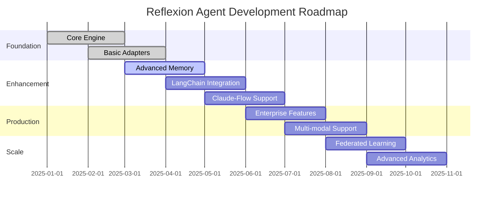

# Reflexion Agent Boilerplate Roadmap

## Project Vision

Transform how AI agents learn and improve by providing production-ready reflexion capabilities that work seamlessly across all major agent frameworks.

## Current Status: v0.1.0 (MVP)

### ✅ Completed Features
- Basic reflexion loop implementation
- AutoGen and CrewAI framework adapters
- Simple episodic memory system
- Core self-critique templates
- Basic metrics tracking

## Roadmap Overview

---

## Release Milestones

### 🎯 v0.2.0 - Enhanced Memory & Evaluation (Q2 2025)

**Release Date:** May 15, 2025

#### Memory System Enhancements
- [ ] **Advanced Episodic Memory**
  - Semantic search with embeddings
  - Configurable retention policies
  - Memory consolidation algorithms
  - Cross-episode pattern recognition

- [ ] **Structured Reflection Storage**
  - PostgreSQL backend implementation
  - Schema versioning and migrations
  - Query optimization for large datasets
  - Backup and recovery procedures

#### Evaluation Framework
- [ ] **Domain-Specific Evaluators**
  - Code quality evaluator
  - Research accuracy evaluator  
  - Creative writing evaluator
  - Mathematical reasoning evaluator

- [ ] **Success Metrics**
  - Configurable success thresholds
  - Multi-dimensional evaluation
  - Temporal success tracking
  - A/B testing framework for strategies

#### Framework Integration
- [ ] **LangChain Adapter**
  - Chain and agent wrapper implementation
  - Memory integration with LangChain stores
  - Tool compatibility layer
  - Streaming response support

#### Developer Experience
- [ ] **Enhanced CLI**
  - Interactive configuration wizard
  - Real-time metrics dashboard
  - Debug mode with detailed logging
  - Performance profiling tools

**Success Criteria:**
- Support for 10,000+ episodes in memory
- < 100ms reflection generation time
- 95% uptime in production environments
- Full LangChain compatibility

---

### 🚀 v0.3.0 - Production Ready (Q3 2025)

**Release Date:** August 30, 2025

#### Enterprise Features
- [ ] **Security & Compliance**
  - End-to-end encryption
  - Role-based access control
  - SOC 2 compliance audit
  - GDPR compliance features

- [ ] **Scalability & Performance**
  - Horizontal scaling support
  - Distributed memory backends
  - Connection pooling
  - Caching optimizations

#### Advanced Reflection
- [ ] **Hierarchical Reflection**
  - Multi-level reflection depth
  - Strategic vs tactical reflection
  - Cross-task meta-learning
  - Reflection chain orchestration

- [ ] **Collaborative Reflection**
  - Multi-agent reflection sharing
  - Collective learning mechanisms  
  - Conflict resolution strategies
  - Knowledge distillation

#### Observability
- [ ] **Advanced Metrics**
  - Real-time performance dashboards
  - Anomaly detection alerts
  - Cost optimization insights
  - Usage pattern analysis

- [ ] **Integration Ecosystem**
  - Weights & Biases integration
  - MLflow experiment tracking
  - Slack/Teams notifications
  - Custom webhook support

#### Framework Expansion
- [ ] **Claude-Flow Adapter**
  - Native workflow integration
  - Task-level reflection configuration
  - Flow-wide learning propagation
  - Checkpoint and resume support

**Success Criteria:**
- Deploy to 100+ production environments
- Handle 1M+ daily reflection operations
- 99.9% availability SLA
- < 50ms P95 response time

---

### 🌟 v0.4.0 - Multi-Modal & Intelligence (Q4 2025)

**Release Date:** November 30, 2025

#### Multi-Modal Capabilities
- [ ] **Vision-Language Reflection**
  - Image analysis and critique
  - Visual reasoning improvement
  - Chart and diagram interpretation
  - Screenshot-based debugging

- [ ] **Audio-Language Integration**
  - Speech-to-text reflection
  - Audio quality assessment
  - Conversation flow analysis
  - Voice synthesis critique

#### Advanced Intelligence
- [ ] **Meta-Learning Framework**
  - Learning-to-learn algorithms
  - Few-shot adaptation
  - Transfer learning across domains
  - Personalization engines

- [ ] **Causal Reasoning**
  - Root cause analysis
  - Counterfactual reasoning
  - Intervention planning
  - Causal graph construction

#### Research Integration
- [ ] **Academic Benchmarks**
  - HumanEval reflexion solver
  - MMLU reasoning evaluator
  - HellaSwag common sense benchmark
  - Custom domain benchmarks

- [ ] **Research Platform**
  - Experiment management
  - Reproducible research tools
  - Dataset generation utilities
  - Publication-ready metrics

**Success Criteria:**
- Support 5+ modalities (text, image, audio, code, structured data)
- Achieve state-of-the-art performance on 3+ benchmarks
- Enable 50+ research publications
- Process 10M+ multi-modal episodes

---

### 🔮 v1.0.0 - Federated Learning & Global Intelligence (Q1 2026)

**Release Date:** February 28, 2026

#### Federated Learning
- [ ] **Distributed Reflexion Network**
  - Privacy-preserving learning
  - Cross-organization knowledge sharing
  - Differential privacy guarantees
  - Blockchain-based incentives

- [ ] **Global Knowledge Base**
  - Community-contributed reflections
  - Verified learning patterns
  - Domain expertise networks
  - Reputation-based trust systems

#### Advanced Analytics
- [ ] **Predictive Intelligence**
  - Failure prediction models
  - Success probability estimation
  - Optimal strategy recommendation
  - Resource usage forecasting

- [ ] **Emergent Behavior Analysis**
  - Agent interaction patterns
  - Collective intelligence emergence
  - Social learning dynamics
  - Swarm optimization insights

#### Platform Maturity
- [ ] **Enterprise Platform**
  - Multi-tenant SaaS offering
  - Custom deployment options
  - Professional services support
  - Training and certification programs

**Success Criteria:**
- 1000+ organizations in federated network
- 100M+ shared learning episodes
- 99.99% availability across all regions
- Industry-standard platform adoption

---

## Feature Priorities

### High Priority (Next 3 Months)
1. **Memory System Redesign** - Critical for scalability
2. **LangChain Integration** - High user demand
3. **Production Monitoring** - Required for enterprise adoption
4. **Documentation Overhaul** - Developer experience improvement

### Medium Priority (3-6 Months)
1. **Claude-Flow Adapter** - Strategic partnership importance
2. **Advanced Evaluators** - Domain-specific value add
3. **Security Hardening** - Enterprise requirement
4. **Performance Optimization** - Competitive advantage

### Low Priority (6+ Months)
1. **Multi-Modal Support** - Future-looking capability
2. **Federated Learning** - Long-term vision
3. **Mobile SDK** - Extended reach
4. **Browser Extension** - Developer tools

---

## Success Metrics

### Technical Metrics
- **Performance**: < 100ms P95 reflection generation time
- **Scalability**: Support 1M+ concurrent reflexion operations
- **Reliability**: 99.9% uptime across all components
- **Quality**: 95% user satisfaction score

### Business Metrics
- **Adoption**: 10,000+ active developers
- **Enterprise**: 100+ paying enterprise customers
- **Community**: 1,000+ GitHub stars, 100+ contributors
- **Revenue**: $1M+ ARR by end of 2025

### Research Impact
- **Publications**: Enable 50+ academic papers
- **Benchmarks**: Achieve SOTA on 5+ standard benchmarks
- **Citations**: 1,000+ citations of reflexion methodology
- **Patents**: File 5+ core technology patents

---

## Risk Management

### Technical Risks
- **Scalability Bottlenecks**: Mitigate with early performance testing
- **Framework Breaking Changes**: Maintain adapter abstraction layers
- **Memory Storage Costs**: Implement intelligent retention policies
- **LLM Provider Dependencies**: Support multiple providers

### Business Risks  
- **Competitive Pressure**: Focus on unique reflexion capabilities
- **Market Adoption**: Invest in developer relations and education
- **Funding Requirements**: Secure partnerships and revenue streams
- **Regulatory Changes**: Monitor AI governance developments

### Mitigation Strategies
- **Technical**: Comprehensive testing, monitoring, and rollback procedures
- **Business**: Diversified revenue streams and strategic partnerships
- **Legal**: Proactive compliance and legal review processes
- **Operational**: Cross-training and documentation for knowledge continuity

---

## Community & Ecosystem

### Open Source Strategy
- **Core Open Source**: Maintain MIT license for core functionality
- **Enterprise Extensions**: Commercial license for advanced features
- **Community Contributions**: Clear contribution guidelines and recognition
- **Plugin Ecosystem**: Third-party adapter and evaluator marketplace

### Partnership Opportunities
- **Framework Vendors**: Deep integrations with AutoGen, CrewAI, LangChain
- **Cloud Providers**: Optimized deployments on AWS, Azure, GCP
- **Research Institutions**: Collaborative research agreements
- **Enterprise Customers**: Co-development of domain-specific features

### Developer Relations
- **Documentation**: Comprehensive guides, tutorials, and examples
- **Community Support**: Discord server, Stack Overflow presence
- **Events**: Conference talks, workshops, and hackathons
- **Content**: Blog posts, videos, and research publications

This roadmap represents our current vision and will be updated quarterly based on user feedback, market conditions, and technical discoveries.